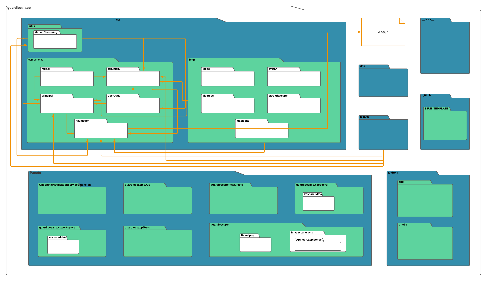

# Arquitetura do projeto

## 1. Introdução

### 1.1 Escopo
O Guardiões da Saúde é um projeto da ProEpi que permite o monitoramento de sintomas de diferentes enfermidades, assim como ajuda para tratar os mesmos.

Este projeto consiste em fazer a reengenharia e a implementação de novos requisitos dentre eles a implementação dos cursos e de um quiz com respostas de multiplas escolhas.

### 1.2 Objetivo
Este documento tem como objetivo apresentar a arquitetura de software do projeto, assim como as tecnologias que serão utilizadas e os diagramas da visão geral da arquitetura. As informações contidas neste documento servem para guiar os desenvolvedores envolvidos a aplicar as instruções no desenvolvimento do projeto.

### 1.3 Definições, acrônimos e abreviações

| Abreviação | Significado |
|---|---|
| HTML | HyperText Markup Language |
| MIT | Massachussets Institute of Technology |
| JS | Javascript |
| CSS | Cascading Style Sheets |
| UnB | Universidade de Brasília |
| SAFe | Scaled Agile Framework |

### 2.1 Javascript
O JavaScript foi criado na década de 90. É uma linguagem de programação de alto nível, funcional, imperativa e versátil. Ele deixa o site mais interativo e dinâmico, além de controlar os elementos de um site em tempo real sem precisar receber dados ou resposta do servidor, ou seja, uma página pode ter o conteúdo atualizado sem precisar recarregá-la completamente quando for preencher um formulário.

A utilidade principal do JavaScript é escrever scripts e funções que são adicionados em uma página HTML com atualizações das informações e interações dinâmicas com o conteúdo da página. O JavaScript pode enviar e receber dados do servidor de modo síncrono ou assíncrono com o processamento, validação e a exibição das info.

### 2.2 React Native
Criado pelo Facebook em 2015 sobre a licença MIT, o React Native é um Framework para desenvolvimento de aplicativos móveis multiplataforma. Baseado no React( framework JS para desenvolvimento web) o React Native possibilita a criação de aplicações móvel multiplataforma (Android e iOS) utilizando apenas Javascript. Porém, diferente de outros frameworks com esta mesma finalidade, todo o código desenvolvido com o React Native é convertido para linguagem nativa do sistema operacional, o que torna o app muito mais fluido.

### 2.3 Ruby
A linguagem Ruby, criada pelo programador japonês Yukihiro Matsumoto em 1995, permite o desenvolvimento ágil e rápido de aplicações. É empregada principalmente no desenvolvimento de aplicações web, mas também pode ser utilizada em outras aplicações de software.

### 2.4 Ruby on Rails
O Ruby on Rails (Framework Ruby) foi criado para desenvolver aplicações web para startups e foi totalmente inspirado no desenvolvimento ágil utilizado nesse tipo de empresa. Hoje, ele é muito empregado também em aplicativos comerciais e corporativos, sistemas de vendas e outras aplicações pela internet.

### 2.5 Docker

O Docker é uma plataforma open source que facilita a criação e administração de ambientes isolados. Ele possibilita o empacotamento de uma aplicação ou ambiente dentro de um container, se tornando portátil para qualquer outro host que contenha o Docker instalado. Então, você consegue criar, implantar, copiar e migrar de um ambiente para outro com maior flexibilidade. A ideia do Docker é subir apenas uma máquina, ao invés de várias. E, nessa única máquina, você pode rodar várias aplicações sem que haja conflitos entre elas.

### 2.6 CSS

CSS é a sigla para o termo em inglês Cascading Style Sheets que, traduzido para o português, significa Folha de Estilo em Cascatas. O CSS é fácil de aprender e entender e é facilmente utilizado com as linguagens de marcação HTML ou XHTML.
O CSS separa o conteúdo da representação visual do site. Utilizando o CSS é possível alterar a cor do texto e do fundo, fonte e espaçamento entre parágrafos. Também pode criar tabelas, usar variações de layouts, ajustar imagens para suas respectivas telas e assim por diante.

### 2.7 Node.js

O Node.js é um ambiente de execução JavaScript de forma assíncrono orientado a eventos, é definido como um interpretador server-side (ao lado do servidor), ou seja, o código é compreendido pelo servidor. Ele melhorou a linguagem JavaScript e seus motores de execução além de permitir a execução de código em JavaScript a nível front-end e back-end.

Esse ambiente de execução é ótimo para ser utilizado como base para uma biblioteca web ou para um framework e por ele não ter operações bloqueantes nas conexões os sistemas são razoavelmente fáceis de serem criados em Node.js. No Node.js é possível reutilizar códigos fazendo com que o desenvolvimento seja mais produtivo além de ser flexível e versátil por ter capacidade de adaptação e por poder ser utilizado em vários cenários.

## 3. Metas e Restrições arquiteturais

### 3.1 Suportabilidade
É um aplicativo mobile que pode ser utilizado sem problemas em dispositivos Android e iOS através de um código somente, devido ao uso do React Native.

### 3.2 Usabilidade
O programa terá a usabilidade dinâmica e intuitiva, de modo ágil e fácil para o usuário.

### 3.3 Tecnologias de Desenvolvimento
As principais tecnologias utilizadas serão o JavaScript e o Ruby, pois são as bases das outras ferramentas para o desenvolvimento do projeto, as demais são o nodeJs, a biblioteca Puppeteer e os frameworks Express JS e Vue JS.

## [4. SAFe](../produto/#521-safe-definido-com-as-clientes)

## 5. Visão Lógica

### 5.1 Diagrama de Atividades

### 5.2 Diagrama de Pacotes

### 5.3 Diagrama de Arquitetura

* App

* API

### [5.4 Diagrama de Classes App](https://lucid.app/lucidchart/758e91c8-366f-42a7-8ead-3fc982255c92/edit?viewport_loc=-2353%2C-1932%2C3840%2C1962%2CfZ5PjUMRxCIX&invitationId=inv_24c36e56-7acd-4588-bf00-c296f4739211#)

## 6. Visão de Implementação
A partir das estruturas conceituais do projeto apresentadas acima, acreditamos que a implementação das mesmas seja possível, dado o maior conhecimento das tecnologias e funcionamento do código previamente estabelecido. Sendo apenas o serviço fornecido pelo repositório da parte Web da aplicação não estando sob nosso controle, a codificação tem utilizado práticas de Clean Code para facilitar a posterior manutenção pela equipe de desenvolvimento da ProEpi.

## 7. Referências:

> Documento de Arquitetura : SIGAA-Plus. Disponível em: https://github.com/fga-eps-mds/2021.2-Sigaa-Plus/blob/main/docs/DocumentoDeArquitetura.md
>
