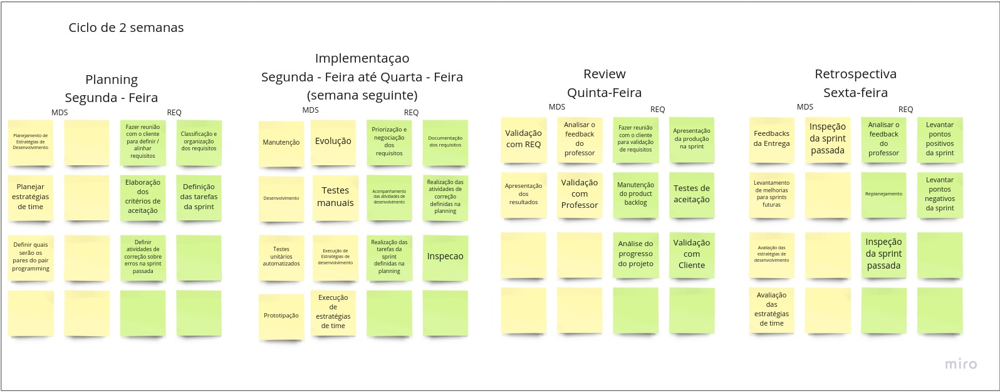

# Visão do Produto e Projeto

O guardiões da saúde é uma solução que foi desenvolvida graças a uma parceria entre Skoll Global Threats Found (SGTF), o Ministério da Saúde, a startup Epitrack e a ProEpi, com intuito de realizar vigilância participatiiva.

## 1 Visão Geral do Produto

### 1.1 Declaração de Posição do Produto

  Ao utilizar desse produto, as instituições poderão realizar QUIZ semanais para avaliar	os usuários cadastrados.

| Para | As instituições que utilizam o GDS |
|--|--|
| Quem |População no geral |
| O (nome do produto) |Quizes |
| Que |Conscientizar o usuário sobre um assunto qualquer relacionado aos cursos e verificar se estes foram realmente vistos |
| Ao contrário |O GDS é uma solução muito específica, portanto não há conhecimento sobre um concorrente até o momento |
| Nosso produto |O GDS é uma solução muito específica, portanto não há uma diferenciação primária no produto |

### 1.2 Objetivos do Produto

Reengenharia de features presentes no Guardiões da Saúde, alteração da necessidade diária de realizar o reporte para semanal. Desenvolvimento do QUIZ,  nova feature para o aplicativo com objetivo de testar o conhecimento do usuário em diversos módulos e desenvolvimento de ferramenta para criação de QUIZ pelas instituições.

### 1.3 Tecnologias a Serem Utilizadas

Para comunicação, utilizamos Whatsapp, Telegram e Discord. A api do Guardiões da Saúde é em Ruby, utilzaremos JavaScript para o desenvolvimento das features. Figma será utilizado para a prototipação e Docker para testes.

## 2 Visao Geral do Projeto

### 2.1 Organizacao do Projeto

|Papel|Atribuicoes|Responsavel|Participantes|
|-----|-----------|-----------|-------------|
|Desenvolvedor Front-End|Codificar o produto, codificar testes unitários, realizar refatoração|MDS|Marcus Martins, Igor Tiago, Juan Mangueira, Tiago Vivan, Iago |
|Desenvolvedor Back-End|Codificar funcionalidades e fluxo de controle da aplicação|MDS|Marcus Martins, Igor Tiago, Juan Mangueira, Tiago Vivan, Iago|
Engenharia de Requsitos|Atualizar o escopo do produto, organizar o escopo das sprints, definir product backlog|Requisitos|Caio César, Hian Praxedes, Matheus Pimentel, Luiz Pettengill, Taynara Cristina|
Tech Lead|Validar as entregas de desenvolvimento|Ítalo|Marcus Martins, Igor Tiago, Juan Mangueira, Tiago Vivan, Iago, Ítalo|
Cliente|Definir necessidades de melhoria no produto e novas ferramentas a serem desenvolvidas|Maria Vitória, Marcela, George Marsicano|Caio César, Hian Praxedes, Matheus Pimentel, Luiz Pettengill, Taynara Cristina, Maria Vitória, Marcela, George Marsicano|

### 2.2 Planejamento das Fases e/ou Iterações do Projeto

<iframe width="768" height="432" src="https://miro.com/app/live-embed/uXjVOiyJ58M=/?moveToViewport=-667,996,1888,760&embedId=414772771427" frameborder="0" scrolling="no" allowfullscreen></iframe>

#### Unidade 2

>A imagem acima exemplifica o processo de desenvolvimento da equipe. As atividades acima dispostas ocorrerao dentro de CADA uma das sprints salvo as sprints 1 e 2 que foram de documentacao, planejamento e capacitacao da equipe.

|Sprint|Produto(Entrega)|Data Inicio|Data Fim|
|------|----------------|-----------|--------|
| Sprint 1 | Definicao do Produto, Criacao do Backlog, Definicao do processo desenvolvimento | 13/06/22 | 24/06/22 |
| Sprint 2 | Definicao do MVP, Negociacao dos Requisitos, Dojos de capacitacao | 27/06/22| 08/07/22 |
| Sprint 3 | Ajuste do ambiente de desenvolvimento | 11/07/22 | 22/07/22 |
| Sprint 4 | Protótipo de tela | 25/07/22| 05/08/22 |
| Sprint 5 | US-01 & US-02 (Registrar reportes ao menos uma vez na semana) | 08/08/22 | 19/08/22 |
| Sprint 6 | Desenvolvimento dos débitos (US-03 & US-04) | 22/08/22 | 02/09/22 |
| Sprint 7 | Desenvolvimento dos débitos (US-33 & US-34) | 05/09/22 | 16/09/22 |
| Sprint 8* | Entrega das funcionalidades desenvolvidas | 19/09/22 | 23/09/22 |

>*= A sprint 8 sera de apenas 1 semana, por ser a sprint de entrega do projeto desenvolvido.

### 2.3 Matriz de Comunicação
|Descricao|Area/Envolvidos|Periodicidade|Local|Produtos Gerados|
|---------|---------------|-------------|-----|----------------|
| Acompanhamento das Atividades em Andamento, Gerenciamento dos Riscos | Equipe de MDS e Equipe de Requisitos | Diário | Grupo do Whatsapp | Sem produtos gerados|
| Comunicar Situação do Projeto | Equipe de MDS, Equipe de Requisitos, Professor | Semanal | Apresentacao parcial em sala de aula | Lista de modificações sugeridas pelo Professor |
| Reunião de revisão e retrospectiva da sprint | Equipe de MDS, Equipe de Requisitos | 1x a cada 2 semanas (Ao final das sprints) | Servidor da equipe no Discord | Melhor gerenciamento de projeto e de riscos |
| Apresentação do progresso da equipe | Equipe de MDS, Equipe de Requisitos, Professor | Ao fim de cada módulo | Apresentação do projeto em sala de aula | Produto e projeto parciais, funcionalidades e documentações desenvolvidas |

### 2.4 Gerenciamento de Riscos

O gerenciamento de riscos do projeto irá permear todo o processo de desenvolvimento tendo como principais atividades as reuniões de Revisão e Retrospectiva das sprints para que sejam melhor comunicados os possiveis novos riscos e tratados os riscos que por ventura ocorreram durante a execucao das atividades da sprint.

- Não conseguir entregar o Backlog da sprint.
  - Ver quais foram os responsáveis pelas partes não entregues e fornecer apoio necessário para que consiga realizar suas tarefas na próxima sprint.
- Membro da equipe trancar a matéria.
  - Comunicação constante entre todos os membros da equipe para que todos os membros sejam informados com antecedência.
- Baixa produtividade em semana de prova.
  - Aumentar produtividade na semana anterior e posterior
- Dificuldades de comunicação entre as equipes de MDS e Requisitos
  - Manter contato ao menos uma vez na semana, na reunião semanal de acompanhamento da sprint.
- Dificuldades de comunicação entre as equipes de MDS e o Ítalo
  - Manter contato constante ao fim de cada sprint, e marcar reuniões com certa frequência
- Dificuldades de comunicação entre as equipes de Requisitos e os Clientes
  - Manter contato constante com as clientes encontrando o melhor horário para pelo menos uma delas, ou tirando dúvidas pelo whatsapp
- Riscos nao planejados
  - Analisar impacto do risco, planejar rapidamento acoes necessarias para mitigar os impactos do mesmo.

### 2.5 Critérios de Replanejamento

O produto será replanejado caso entenda-se que o escopo está inadequado, isto é, grande ou pequeno demais para o tempo da matéria e tamanho da equipe. Também poderá ocorrer seu replanejamento caso os clientes necessitem de uma nova funcionalidade, sendo necessário um backlog atualizado e uma revisão das sprints ate o presente momento.

## 3 Processo de desenvolvimento de software

### 3.1 Metodologia Adotada

A partir da abordagem Gupta, percebemos que era melhor um ciclo de vida evolutivo devido ao pouco conhecimento da tecnologia utilizada pelo projeto dos clientes por parte dos integrantes da equipe. Portanto escolhemos a metodologia ScrumXP (seguindo o manual essencial do SAFe), aderindo seus valores de comunicação, simplicidade, feedbacks, coragem e respeito.

#### 3.2 Atividades de Desenvolvimento

Utilizaremos para a gestão de tarefas as Sprints, da metodologia Scrum, tendo intervalos de uma semana entre as entregas, e a tabela vinda da metodologia KanBan

Dentre as atividades das sprints, serão desempenhadas:

#### 3.2.1 Planejamento

|Atividade | Entrega | Método | Ferramenta |
|----------|---------|--------|------------|
| Planejamento de estrategias de desenvolvimento | Estratégias de desenvolvimento definidas | Reunião de planejamento (Planning) | Discord da equipe |

|Atividade | Entrega | Método | Ferramenta |
|----------|---------|--------|------------|
| Planejar estratégias da equipe | Estratégias da equipe definidas | Reunião de planejamento (Planning) | Discord da equipe |

|Atividade | Entrega | Método | Ferramenta |
|----------|---------|--------|------------|
| Definicao dos pares do pair programming | Pares da semana formados | Reunião de planejamento (Planning) | Discord da equipe |

#### 3.2.2 Execução

|Atividade | Entrega | Método | Ferramenta |
|----------|---------|--------|------------|
| Manutenção de código de Sprints passadas | Bugs corrigidos | programação em pares | Discord da equipe |

|Atividade | Entrega | Método | Ferramenta |
|----------|---------|--------|------------|
| Evolução de código de Sprints passadas | Melhorias de performance e aperfeiçoamento de código | programação em pares | Discord da equipe |

|Atividade | Entrega | Método | Ferramenta |
|----------|---------|--------|------------|
| Desenvolvimento de novas funcionalidades | Código para validação com equipe de requisitos |  programação em pares | Discord da equipe |

|Atividade | Entrega | Método | Ferramenta |
|----------|---------|--------|------------|
| Prototipação | Protótipos de baixa e alta fidelidade prontos para validação com clientes | prototipação em pares | Figma + Discord da equipe |

#### 3.2.3 Revisão

|Atividade | Entrega | Método | Ferramenta |
|----------|---------|--------|------------|
| Validação com a equipe de Requisitos | Funcionalidades Alteradas se nescessario para validação com o professor | Inspeção de código | Discord da equipe |

|Atividade | Entrega | Método | Ferramenta |
|----------|---------|--------|------------|
| Análise do feedback do professor | Alterações com base na analise | Reunião de revisão (Review) | Discord da equipe |

|Atividade | Entrega | Método | Ferramenta |
|----------|---------|--------|------------|
| Apresentação dos resultados da sprint | Validação ou reprovação dos métodos utilizados na sprint | Reunião de revisão (Review) | Discord da equipe |

|Atividade | Entrega | Método | Ferramenta |
|----------|---------|--------|------------|
| Validação com o professor | Entrega das funcionalidades aprovadas | Apresentação de ponto de controle | Aula |

#### 3.2.4 Retrospectiva

|Atividade | Entrega | Método | Ferramenta |
|----------|---------|--------|------------|
| Recebimento dos feedbacks de entrega | Feedbacks discutidos com resoluções para feedbacks negativos | Apresentação da unidade | Aula |

|Atividade | Entrega | Método | Ferramenta |
|----------|---------|--------|------------|
| Inspeção da sprint passada | Sprint revisada com pontos de melhoria | Reunião de retrospectiva (Retrospective) | Discord da equipe |

|Atividade | Entrega | Método | Ferramenta |
|----------|---------|--------|------------|
| Levantamento de melhorias para as próximas sprints | Pontos de melhoria claros | Reunião de retrospectiva (Retrospective) | Discord da equipe |

|Atividade | Entrega | Método | Ferramenta |
|----------|---------|--------|------------|
| Avaliaçào das estratégias de desenvolvimento |  Pontos positivos e negativos da estratégia e possíveis mudanças se necessário | Reunião de retrospectiva (Retrospective) | Discord da equipe |

|Atividade | Entrega | Método | Ferramenta |
|----------|---------|--------|------------|
| Avaliação das estratégias da equipe | Pontos positivos e negativos da estratégia e pontos de melhoria | Reunião de retrospectiva (Retrospective) | Discord da equipe |

## 4 Processo de Engenharia de Requisitos

### 4.1 Metodologia

O processo de engenharia de requisitos escolhido seguirá o mesmo modelo definido para o desenvolvimento de software, uma vez que as equipes de engenharia de requisitos e de engenharia de software estão trabalhando conjuntamente. Isso tornará mais fácil a integração entre as duas equipes. Com isso em mente, o processo escolhido foi o Extreme Programming, ou XP, e as atividades que serão executadas pela equipe de engenharia de requisitos podem ser vistas detalhadamente nas tabelas presentes nos subtópicos abaixo.

### 4.2 Atividades

#### 4.2.1 Planejamento

| Atividade | Entrega | Método | Ferramenta |
|-----------|---------|--------|------------|
| Validação de requisitos | Requisitos bem definidos de acordo com Histórias de usuário | Reuniao com os clientes para definicao / alinhamento de requisitos | Microsoft Teams |

| Atividade | Entrega | Método | Ferramenta |
|-----------|---------|--------|------------|
| Classificação / Organização dos requisitos | Requisitos organizados | Verificação de prioridades de acordo com as Histórias de usuário deifnidas no SAFe | Discord da equipe |

| Atividade | Entrega | Método | Ferramenta |
|-----------|---------|--------|------------|
| Elaboração dos criterios de aceitacao | Critérios concisos e de acordo com as Histórias de usuários | Criação de critérios seguindo as definições do DoR e Dod | Documentação no gitpages & zenhub + Discord da equipe |

| Atividade | Entrega | Método | Ferramenta |
|-----------|---------|--------|------------|
| Definição das tarefas da sprint | Tarefas e papeis definidos | Reunião com a equipe e definição de papéis | Discord da equipe |

| Atividade | Entrega | Método | Ferramenta |
|-----------|---------|--------|------------|
| Definir atividades de correção de erros das sprints passadas | Atividades de correção de erros definidas | Reunião para discutir o motivo dos erros e trata-los | Discord da equipe |

#### 4.2.2 Execucao

| Atividade | Entrega | Método | Ferramenta |
|-----------|---------|--------|------------|
| Priorização e negociação dos requisitos | Requisitos organizados por prioridade | Reunião com Clientes | Microsoft Teams |

| Atividade | Entrega | Método | Ferramenta |
|-----------|---------|--------|------------|
| Documentação dos requisitos | Requisitos documentados na Página GitHub Pages | Transcrição de requisitos definidos com Clientes | Documentação no git pages + Discord da equipe|

| Atividade | Entrega | Método | Ferramenta |
|-----------|---------|--------|------------|
| Acompanhamento das atividades de desenvolvimento | Atividades de desenvolvimento monitoradas | Reunião com equipe de MDS e REQ | Discord da equipe |

| Atividade | Entrega | Método | Ferramenta |
|-----------|---------|--------|------------|
| Realizacao das atividades de correcao definidas no planejamento | Erros corrigidos | Tratamento de erros encontrados, pela equipe de desenvolvimento | Discord da equipe |

| Atividade | Entrega | Método | Ferramenta |
|-----------|---------|--------|------------|
| Realizacao das tarefas da sprint definidas no planejamento | Tarefas realizadas | Execução em pares | Discord da equipe |

| Atividade | Entrega | Método | Ferramenta |
|-----------|---------|--------|------------|
| Inspeção | Erros identificados e reportados | Inspeção durante a execução da equipe de desenvolvimento | Discord da equipe |

#### 4.2.3 Revisao

| Atividade | Entrega | Método | Ferramenta |
|-----------|---------|--------|------------|
| Reuniao com os clientes para a validacao dos requisitos | Requisitos validados | Reunião de revisão (Review) | Microsoft Teams |

| Atividade | Entrega | Método | Ferramenta |
|-----------|---------|--------|------------|
| Apresentação da produção na sprint | Sprint Review | Reunião de revisão (Review) | Discord da equipe |

| Atividade | Entrega | Método | Ferramenta |
|-----------|---------|--------|------------|
| Manutenção do product backlog | Visão de Produto e ZenHub | Reunião de revisão (Review) | Discord da equipe |

| Atividade | Entrega | Método | Ferramenta |
|-----------|---------|--------|------------|
| Analise do progresso do projeto | Atual situação do andamento do projeto | Reunião de revisão (Review) | Discord da equipe |

| Atividade | Entrega | Método | Ferramenta |
|-----------|---------|--------|------------|
| Validacao com o cliente | Entregas validadas | Apresentação de entregas | Microsoft Teams |

#### 4.2.4 Retrospectiva

| Atividade | Entrega | Método | Ferramenta |
|-----------|---------|--------|------------|
| Analisar o feedback do professor | Alterações e replanejamento com base na análise | Reunião da equipe de Requisitos | Stand up meeting após as aulas de pontos de controle |

| Atividade | Entrega | Método | Ferramenta |
|-----------|---------|--------|------------|
| Levantar pontos positivos da sprint | Pontos positivos definidos | Reunião com a equipe | Discord | |

| Atividade | Entrega | Método | Ferramenta |
|-----------|---------|--------|------------|
| Replanejamento | Replanejamento feito | Análise levando em consideração pontos positivos, negativos e feedbacks  | Discord da equipe |

| Atividade | Entrega | Método | Ferramenta |
|-----------|---------|--------|------------|
| Levantar pontos negativos da sprint | Pontos negativos definidos | Reunião de retrospectiva (Retrospective) | Discord da equipe |

| Atividade | Entrega | Método | Ferramenta |
|-----------|---------|--------|------------|
| Inspecao da sprint passada | Pontos de melhora e erros levantados | Levantamento de espectativas e trabalho cumprido | Discord da equipe |
 
## 5 Escopo do Produto

### 5.1 Requisitos funcionais

#### 5.1.1 Lista de Requisitos Funcionais (Reengenharia)

- RF01: Cadastrar nova conta de usuário (APP)
- RF02: Cadastrar nova conta de administrador (WEB)
- RF03: Recuperar a senha do usuário pelo e-mail cadastrado (APP)
- RF04: Recuperar a senha de administrador pelo e-mail cadastrado (WEB)
- RF05: Cadastrar dados do usuário (APP)
- RF06: Cadastrar dados do administrador (WEB)
- RF07: Adicionar mais contas conectadas ao aplicativo (APP)
- RF08: Trocar de conta do usuário (APP)
- RF09: Cancelar participação no aplicativo (APP)
- RF10: Reportar diariamente estado de saúde(APP)
- RF11: Enviar notificações de report (APP)
- RF12: Editar dados cadastrais do usuário (APP)
- RF13: Cadastrar vacinas (APP)
- RF14: Mostrar dias que os reports foram feitos (APP)
- RF15: Mostrar gráfico com porcentagem dos reports feitos (APP)
- RF16: Informar localização de onde o report foi feito (APP)
- RF17: Visualizar opções de dicas de saúde e higiene (APP)
- RF18: Visualizar notícias do Twitter da Proepi (APP)
- RF19: Visualizar número de reports seguidos marcados como bem (APP)
- RF20: Visualizar mapa hospitais/unidades de saúde (APP)
- RF21: Visualizar métricas de reporte (WEB)
- RF22: Visualizar contatos da Proepi (WEB)
- RF23: Visualizar dados da equipe técnica (WEB)
- RF24: Confirgurar Apps (WEB)
 

* Administrador: administrador, gerente, gerente de município, instituição equipe de instituição.

#### 5.1.2 Lista de Requisitos Funcionais (Clientes)

- RF01: Registar reportes ao menos uma vez na semana (APP)
- RF02: Visualizar histórico de saúde (APP)
- RF03: Responder o quiz (APP)
- RF04: Visualizar status do quiz (APP) 
- RF05: Visualizar notas dos quizzes (APP)
- RF06: Visualizar dados do curso (APP)
- RF07: Vizualizar conteúdo do curso (APP)
- RF08: Notificar o usuário até o reporte ser realizado (APP)
- RF09: Criar quiz (WEB)
- RF10: Visualizar dados sobre o quiz (WEB)
- RF11: Criar curso (WEB)
- RF12: Visualizar resultado dos quizzes (WEB)

#### 5.2.1 SAFE (Definido com as clientes)

<table style="width:100%">
  <thead>
    <tr>
      <th>ÉPICO</th>
      <th>ID</th>
      <th>FEATURE</th>
      <th>ID</th>
      <th>HISTÓRIA</th>
      <th>PRIORIDADE</th>
    </tr>
  </thead>
  <tbody>
    <tr>
      <td rowspan="6">Modificações no App</td>
      <td rowspan="2">FT - 01</td>
      <td rowspan="2">Registrar reportes ao menos uma vez na semana (APP)</td>
      <td>US - 01</td>
      <td>Eu, como usuário do produto, quero fazer meu reporte ao menos uma vez na semana, com o intuito de registrar meu estado de saúde nesse período de tempo</td>
      <td align="center">ALTA</td>
    </tr>
    <tr>
      <td>US - 02</td>
      <td>Eu, como usuário do produto, quero ser notificado do reporte, para que eu lembre de fazer o reporte semanal</td>
      <td align="center">MÉDIA</td>
    </tr>
    <tr>
      <td rowspan="2">FT - 02</td>
      <td rowspan="2">Visualizar histórico de saúde (APP)</td>
      <td>US - 03</td>
      <td>Eu, como usuário do produto, quero poder ver os sintomas dos dias em que eu estive mal, com o intuito de saber o que estava sentindo naquele dia</td>
      <td align="center">ALTA</td>
    </tr>
    <tr>
      <td>US - 04</td>
      <td>Eu, como usuário do produto, quero saber quantos dias tive os mesmos sintomas, com o intuito saber quantos dias eu permaneci sintomático</td>
      <td align="center">BAIXA</td>
    </tr>
    <tr>
      <td rowspan="2">FT - 03</td>
      <td rowspan="2">Notificar o usuário até o reporte ser realizado (APP)</td>
      <td>US - 05</td>
      <td>Eu, como instituição, quero receber pelo menos um reporte por semana de cada usuário, para registrar a taxa de contaminação</td>
      <td align="center">ALTA</td>
    </tr>
    <tr>
      <td>US - 06</td>
      <td>Eu, como usuário do produto, não quero ser mais notificado caso já tenha realizado o reporte, para que não seja incomodado já tendo os realizado</td>
      <td align="center">MÉDIA</td>
    </tr>
    <tr>
      <td rowspan="21">Quiz</td>
      <td rowspan="3">FT - 04</td>
      <td rowspan="3">Criar quiz (WEB)</td>
      <td>US - 07</td>
      <td>Eu, como instituição, quero criar quiz para avaliar o conhecimento dos estudantes, para dar um estímulo para ser um conhecimento básico sobre saúde</td>
      <td align="center">ALTA</td>
    </tr>
    <tr>  
      <td>US - 08</td>
      <td>Eu, como instituição, quero poder editar o quiz, para que esteja sempre atualizado</td>
      <td align="center">ALTA</td>
    </tr>
    <tr>
      <td>US - 09</td>
      <td>Eu, como instituição, quero poder excluir um quiz caso queira. Para que esteja sempre atualizado.</td>
      <td align="center">ALTA</td>
    </tr>
    <tr>
      <td rowspan="2">FT - 05</td>
      <td rowspan="2">Notificação do quiz (APP)</td>
      <td>US - 10</td>
      <td>Eu, como usuário do produto, quero receber notificação de quizzes novos para não esquecer de realizar nenhum.</td>
      <td align="center">MÉDIA</td>
    </tr>
    <tr>
      <td>US - 11</td>
      <td>Eu, como usuário do produto, quero receber notificação caso não tenha enviado a resolução de um quiz, para que a minha nota não fique prejudicada.</td>
      <td align="center">MÉDIA</td>
    </tr>
    <tr>
      <td rowspan="3">FT - 06</td>
      <td rowspan="3">Responder o quiz (APP)</td>
      <td>US - 12</td>
      <td>Eu, como usuário do produto, quero responder os quizzes disponibilizados para mim, com o intuito de testar meus conhecimentos adquiridos sobre o tema</td>
      <td align="center">ALTA</td>
    </tr>
    <tr>
      <td>US - 13</td>
      <td>Eu, como usuário do produto, quero poder responder novamente o quiz caso sinta a necessidade, com o intuito de aumentar minha nota neste quiz respondido</td>
      <td align="center">ALTA</td>
    </tr>
    <tr>
      <td>US - 14</td>
      <td>Eu, como usuário do produto, quero visualizar o resultado das questões do quiz quando acabar de responde-lo, com o intuito de observar as respostas das questões que foram respondidas</td>
      <td align="center">BAIXA</td>
    </tr>
    <tr>
      <td rowspan="3">FT - 07</td>
      <td rowspan="3">Visualizar status do quiz (APP)</td>
      <td>US - 16</td>
      <td>Eu, como usuário do produto, quero poder visualizar se os quizzes ainda não foram respondidos no módulo, com o intuito de saber qual quiz ainda não foi respondido</td>
      <td align="center">ALTA</td>
    </tr>
    <tr>
      <td>US - 17</td>
      <td>Eu, como usuário do produto, quero poder visualizar se os quizzes estão em aberto, com o intuito de saber se algum quiz não foi terminado</td>
      <td align="center">ALTA</td>
    </tr>
    <tr>
      <td>US - 18</td>
      <td>Eu, como usuário do produto, quero poder visualizar se os quizzes foram respondidos, com o intuito de saber quais módulos foram feitos</td>
      <td align="center">ALTA</td>
    </tr>
    <tr>
      <td rowspan="3">FT - 08</td>
      <td rowspan="3">Dados do quiz (WEB)</td>
      <td>US - 19</td>
      <td>Eu, como instituição, quero visualizar como os estudantes se saíram no quiz para avaliar seus conhecimentos</td>
      <td align="center">ALTA</td>
    </tr>
    <tr>
      <td>US - 20</td>
      <td>Eu, como instituição, quero visualizar o nome do estudante que fez o quiz, para poder avalia-lo corretamente</td>
      <td align="center">ALTA</td>
    </tr>
    <tr>
      <td>US - 21</td>
      <td>Eu, como instituição, quero visualizar a matrícula do estudante que fez o quiz, para poder avalia-lo corretamente</td>
      <td align="center">ALTA</td>
    </tr>
    <tr>
      <td rowspan="3">FT - 09</td>
      <td rowspan="3">Visualizar nota dos quizzes (APP)</td>
      <td>US - 22</td>
      <td>Eu, como usuário do produto, quero poder visualizar as notas dos quizzes que foram respondidos, com o intuito de saber meu desempenho</td>
      <td align="center">ALTA</td>
    </tr>
    <tr>
      <td>US - 23</td>
      <td>Eu, como usuário do produto, quero poder visualizar a média das notas dos quizzes por módulo, com o intuito de saber meu desempenho em cada módulo</td>
      <td align="center">MÉDIA</td>
    </tr>
    <tr>
      <td>US - 24</td>
      <td>Eu, como usuário do produto, quero saber se passei no quiz ou se preciso fazer novamente para não perder nenhuma avaliação</td>
      <td align="center">ALTA</td>
    </tr>
     <tr>
      <td rowspan="4">FT - 10</td>
      <td rowspan="4">Visualizar resultado dos quizzes</td>
      <td>US - 26</td>
      <td>Eu, como instituição, quero saber a média da nota dos módulos disponibilizados</td>
      <td align="center">ALTA</td>
    </tr>
    <tr>
      <td>US - 27</td>
      <td>Eu, como instituição, quero saber a nota dos quizzes disponibilizados</td>
      <td align="center">ALTA</td>
    </tr>
    <tr>
      <td>US - 28</td>
      <td>Eu, como instituição, quero saber o nome do usuário e suas respectivas notas</td>
      <td align="center">ALTA</td>
    </tr>
    <tr>
      <td>US - 29</td>
      <td>Eu, como instituição, quero saber a matrícula do usuário e suas respectivas notas</td>
      <td align="center">ALTA</td>
    </tr>
    <tr>
      <td rowspan="7">Curso</td>
      <td rowspan="3">FT - 11</td>
      <td rowspan="3">Criar curso (WEB)</td>
      <td>US - 30</td>
      <td>Eu, como instituição, quero inserir informações sobre o conteúdo que será estudado, para que os usuários tenham um material para se informarem sobre os assuntos dos quizzes</td>
      <td align="center">ALTA</td>
    </tr>
    <tr>
      <td>US - 31</td>
      <td>Eu, como instituição, quero editar as informações inseridas no curso, para que estejam sempre atualizadas</td>
      <td align="center">MÉDIA</td>
    </tr>
    <tr>
      <td>US - 32</td>
      <td>Eu, como instituição, quero poder excluir um curso, para que eu consiga remover um curso que não é mais necessário</td>
      <td align="center">MÉDIA</td>
    </tr>
    <tr>
      <td rowspan="2">FT - 12</td>
      <td rowspan="2">Visualizar dados do curso (APP)</td>
      <td>US - 33</td>
      <td>Eu, como usuário do produto, quero poder visualizar tema de cada curso do módulo, com o intuito de saber o que será abordado</td>
      <td align="center">MÉDIA</td>
    </tr>
    <tr>
      <td>US - 34</td>
      <td>Eu, como usuário do produto, quero poder visualizar quanto módulos estão disponíveis para serem vistos, com o intuito de saber a quantidade de conteúdo para ser estudado</td>
      <td align="center">MÉDIA</td>
    </tr>
    <tr>
      <td rowspan="2">FT - 13</td>
      <td rowspan="2">Visualizar conteúdo do curso (APP)</td>
      <td>US - 35</td>
      <td>Eu, como usuário do produto, quero poder visualizar os link de redirecionamento para os conteúdos dos curso, com o intuito de estudar o assunto abordado</td>
    <td align="center">ALTA</td>
    </tr>
    <tr>
      <td>US - 36</td>
      <td>Eu, como usuário do produto, quero poder visualizar se o conteúdo do curso já foi acessado, com o intuito de saber se quais conteúdos já foram vistos</td>
      <td align="center">MÉDIA</td>
    </tr>
  </tbody>
</table>

| Legenda (prioridades) | Definição |
|-----------------------|-----------|
| Alta  |  Requisitos sem os quais a aplicação é considerada incompleta |
| Média |  Requisitos importantes que podem ser postergados |
| Baixa |  Requisitos sem os quais o Sistema funciona de maneira satisfatória |

#### 5.2.2 SAFE (Reengenharia)

<table style="width:100%">
  <thead>
    <tr>
      <th>ÉPICO</th>
      <th>ID</th>
      <th>FEATURE</th>
      <th>ID</th>
      <th>HISTÓRIA</th>
    </tr>
  </thead>
  <tbody>
    <tr>
      <td rowspan="11">Autenticação</td>
      <td rowspan="2">FT - 01</td>
      <td rowspan="2">Realizar cadastro de uma nova conta de usuário (APP)</td>
      <td>US - 01</td>
      <td>Eu, como usuário do produto, desejo poder criar uma nova conta para que possa acessar as funcionalidades do APP</td>
    </tr>
    <tr>
    <td>US - 02</td>
    <td>Eu, como usuário do produto, quero poder me conectar na minha conta, para ter acesso as minhas funcionalidades</td>
    </tr>
    <tr>
      <td rowspan="2">FT - 02</td>
      <td rowspan="2">Realizar cadastro de uma nova conta de administrador (WEB)</td>
      <td>US - 03</td>
      <td>Eu, como instituição, desejo poder criar uma nova conta para que possa acessar as funcionalidades do APP</td>
    </tr>
      <tr>
      <td>US - 04</td>
      <td>Eu, como instituição, quero poder me conectar na minha conta, para ter acesso as minhas funcionalidades</td>
    </tr>
    <tr>
      <td rowspan="1">FT - 03</td>
      <td rowspan="1">Cadastrar dados do usuário (APP)</td>
      <td>US - 05</td>
      <td>Eu, como usuário do produto, quero poder adicionar as minhas informações para que meus dados estejam corretos</td>
    </tr>
    <tr>
      <td rowspan="1">FT - 04</td>
      <td rowspan="1">Cadastrar dados do administrador (WEB)</td>
      <td>US - 06</td>
      <td>Eu, como instituição, quero poder adicionar as minhas informações para que meus dados estejam corretos</td>
    </tr> 
    <tr>
      <td rowspan="1">FT - 05</td>
      <td rowspan="1">Recuperar a senha do usuário pelo e-mail cadastrado (APP)</td>
      <td>US - 07</td>
      <td>Eu, como usuário do produto, quero poder recuperar minha senha para que sempre possa acessar as funcionalidades do app</td>
    </tr>
    <tr>
      <td rowspan="1">FT - 06</td>
      <td rowspan="1">Recuperar a senha do administrador pelo e-mail cadastrado (WEB)</td>
      <td>US - 08</td>
      <td>Eu, como instituição, quero poder recuperar minha senha para que sempre possa acessar as funcionalidades do app</td>
    </tr>
    <tr>
      <td rowspan="1">FT - 07</td>
      <td rowspan="1">Cancelar participação no aplicativo (APP)</td>
      <td>US - 09</td>
      <td>Eu, como usuário do produto, quero poder deletar a minha conta caso não queira participar do app</td>
    </tr>
    <tr>
      <td rowspan="1">FT - 08</td>
      <td rowspan="1">Adicionar mais contas conectadas ao aplicativo (APP)</td>
      <td>US - 10</td>
      <td>Eu, como usuário do produto, quero poder conectar várias contas no aplicativo para que outras pessoas tenham acesso as funcionalidades do app</td>
    </tr>
    <tr>
      <td rowspan="1">FT - 09</td>
      <td rowspan="1">Trocar de conta do usuário (APP)</td>
      <td>US - 11</td>
      <td>Eu, como usuário do produto, quero poder trocar de conta durante o uso do app para que todas as contas acessem as funcionalidades e seus dados</td>
    </tr>
    <tr>
      <td rowspan="2">Dados usuário</td>
      <td rowspan="1">FT - 10</td>
      <td rowspan="1">Editar dados cadastrais do usuário (APP)</td>
      <td>US - 12</td>
      <td>Eu, como usuário do produto, quero poder ataulizar meus dados a qualquer momento para que todos as minhas informações estejam corretas</td>
    </tr>
    <tr>
      <td rowspan="1">FT - 11</td>
      <td rowspan="1">Cadastrar vacinas (APP)</td>
      <td>US - 13</td>
      <td>Eu, como usuário do produto, quero poder adicionar todas as doses de vacina que tomei para que tenha um maior controle sobre a minha saúde</td>
    </tr>
    <tr>
      <td rowspan="1">Notificação</td>
      <td rowspan="1">FT - 12</td>
      <td rowspan="1">Enviar notificações de report (APP)</td>
      <td>US - 14</td>
      <td>Eu, como usuário do produto, quero receber notificações sobre o reporte para que não esquece de realizá-lo</td>
    </tr>
    <tr>
      <td rowspan="2">Informação</td>
      <td rowspan="2">FT - 13</td>
      <td rowspan="1">Visualizar opções de dicas de saúde e higiene (APP)</td>
      <td>US - 15</td>
      <td>Eu, como usuário do produto, quero poder me informações sobre questões de saúde e higiêne para me manter sempre atualizado</td>
    </tr>
    <tr>
    <td rowspan="1">Visualizar notícias do Twitter da Proepi (APP)</td>
    <td>US - 16</td>
    <td>Eu, como usuário do produto, quero visualizar as notícias da Proepi para me manter atualizado</td>
    </tr>
    <tr>
      <td rowspan="5">Reporte</td>
      <td rowspan="1">FT - 14</td>
      <td rowspan="1">Reportar diariamente estado de saúde(APP)</td>
      <td>US - 17</td>
      <td>Eu, como usuário do produto, quero realizar o reporte todos os dias para que possa saber como tenho me sentido</td>
    </tr>
    <tr>
      <td rowspan="1">FT - 15</td>
      <td rowspan="1">Mostrar dias que os reports foram feitos (APP)</td>
      <td>US - 18</td>
      <td>Eu, como usuário do produto, quero poder ver quais dias realizei o reporte para ter maior controle sobre minha saúde</td>
    </tr>
    <tr>
      <td rowspan="1">FT - 16</td>
      <td rowspan="1">Mostrar gráfico com porcentagem dos reports feitos (APP)</td>
      <td>US - 19</td>
      <td>Eu, como usuário do produto, quero ver o comparativo de como tenho me sentido para mapear melhor minha saúde e melhorar minhas atitudes de acordo com meu histórico</td>
    </tr>
    <tr>
      <td rowspan="1">FT - 17</td>
      <td rowspan="1">Informar localização de onde o report foi feito (APP)</td>
      <td>US - 20</td>
      <td>Eu, como usuário do produto, quero poder mostrar minha localização para ter noção de como as pessoas estão ao meu redor e ver quais postos estão perto de mim</td>
    </tr>
    <tr>
      <td rowspan="1">FT - 18</td>
      <td rowspan="1">Visualizar número de reports seguidos marcados como bem (APP)</td>
      <td>US - 21</td>
      <td>Eu, como usuário do produto, quero ver quantos dias permaneci assintomático para saber se meus cuidados estão permanecendo suficientes</td>
    </tr>
    <tr>
      <td rowspan="1">Mapa</td>
      <td rowspan="1">FT - 19</td>
      <td rowspan="1">Visualizar mapa hospitais/unidades de saúde (APP)</td>
      <td>US - 22</td>
      <td>Eu, como usuário do produto, quero saber quais unidades de saúde estão perto de mim para que no caso de uma emergência eu saiba para onde ir</td>
    </tr>
  </tbody>
</table>

#### 5.3 Requisitos não funcionais

<table>
  <thead>
    <tr>
      <th>Requisitos Não Funcionais (Classificação)</th>
      <th>RNf</th>
    </tr>
  </thead>
  <tbody>
    <tr>
      <td rowspan="4">Requisitos de Implementação</td>
      <td>O backend do produto deve ser desenvolvido em JavaScript</td>
    </tr>
    <tr>
      <td>O frontend do produto será desenvolvido em React Native</td>
    </tr>
    <tr>
      <td>O protótipo do front end será feito no Figma</td>
    </tr>
    <tr>
      <td>A responsidade do produto será feita utilizando a aplicação PWA</td>
    </tr>
    <tr>
      <td>Requisitos Legislativos</td>
      <td>O produto esteja de acordo com a LGPD (Lei geral de proteção de dados)</td>
    </tr>
    <tr>
      <td rowspan="9">Requisitos de Usabilidade</td>
      <td>O produto deve funcionar em android e ios</td>
    </tr>
    <tr>
      <td>O produto deve deixar destacado caso o usuário termine o curso</td>
    </tr>
    <tr>
      <td>O produto deve deixar destacado caso o usuário termine o quiz com nota maior que 50%</td>
    </tr>
    <tr>
      <td>O produto deve mostrar a nota do quiz, referente ao módulo que o usuário está</td>
    </tr>
    <tr>
      <td>O produto deve funcionar apenas com acesso à internet</td>
    </tr>
    <tr>
      <td>O produto deve dar a opção entre refazer quiz ou passar para o próximo módulo</td>
    </tr>
    <tr>
      <td>O produto deve fazer uso de pop-ups</td>
    </tr>
    <tr>
      <td>Deve ser possível ver seu histórico de reports tanto no formato de calendário quanto de estatística (gráfico de pizza)</td>
    </tr>
    <tr>
      <td>O aplicativo não deve exigir muito do aparelho em que está sendo usado</td>
    </tr>
    <tr>
      <td rowspan="2">Requisito de Portabilidade</td>
      <td>O produto deve ser acessível via mobile</td>
    </tr>
    <tr>
      <td>As instituições contratantes devem acessar as funcionalidades por meio de dashboards web</td>
    </tr>
  </tbody>
</table>

## 6 Referências bibliográficas

- SWEBOK v3.0 - Guide to the Software Engineering body of knowledge
- SAFe 5 - https://www.scaledagileframework.com/
- Aguiar, F. e Caroli, P. “Product Backlo Building: Um guia prático para a criação e refinamento de backlog para produtos de sucesso”. Edtora Caroli, RJ. 2021.
- Aguiar, F.  Scrum PBB. Disponível em: http://www.productbacklogbuilding.com/slides/ScrumPBB.pdf
- Succeeding with Agile Software development using Scrum. Mike Cohn. Addison-Wesley, 2010.
- Agile Product Management with Scrum Creating Products that Customers Love. Roman Pichler. Addison-Wesley, 2010.
- Agile: Desenvolvimento de software frequentes e foco no valor de negócio. André Faria Gomes. Casa do Código.
- Agile Practice Guide. Project Management Institute, Inc. 2017.