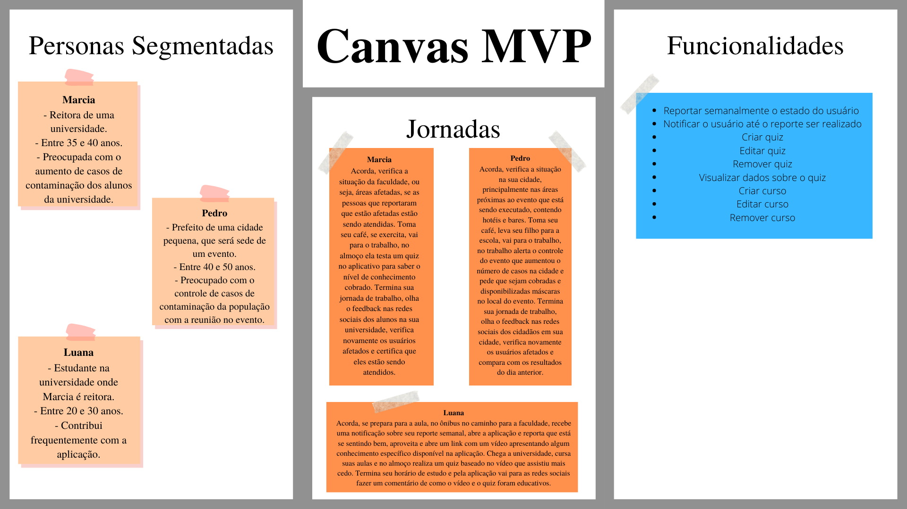

# Visão Do Produto e Projeto

## Sumário

- 1 Visão Geral do Produto
  - 1.1 Declaração de Posição do Produto
  - 1.2 Objetivos do Produto
  - 1.3 Tecnologias a serem Utilizadas
- 2 Visão Geral do Projeto
  - 2.1 Organização do Projeto
  - 2.2 Planejamento das Fases e/ou Iterações
  - 2.3 Matriz de Comunicação
  - 2.4 Gerenciamento de Riscos
  - 2.5 Critérios de Replanejamento
- 3 Processo de Desenvolvimento de Software
  - 3.1 Metodologia Adotada
  - 3.2 Atividades de Desenvolvimento
    - 3.2.1 Planejamento
    - 3.2.2 Execução
    - 3.2.3 Revisão
    - 3.2.4 Retrospectiva
- 4 Processo de Engenharia de Requisitos
  - 4.1 Elicitação de Requisitos
  - 4.2 Análise de Requisitos
  - 4.3 Documetação de Requisitos
  - 4.4 Verificação e Validação de requisitos
  - 4.5 Gerenciamento de Requisitos
- 5 Escopo do Produto
  - 5.1 Requisitos funcionais
    - 5.1.1 Lista de Requisitos Funcionais (Reengenharia)
    - 5.1.2 Lista de Requisitos Funcionais (Clientes)
    - 5.2 Requisitos Funcionais - SAFE
- 6 Definicao dos MVPs
  - 6.1 MVP 1
  - 6.2 MVP 2
- 7 Canvas MVP
- 8 Lições Aprendidas
  - 8.1 Unidade 1
    - 8.1.1 MDS
    - 8.1.2 Requisitos
    - 8.1.3 MDS e Requisitos
- 9 Referências Bibliográficas

## Visão do Produto e Projeto

O guardiões da saúde é uma solução que foi desenvolvida graças a uma parceria entre Skoll Global Threats Found (SGTF), o Ministério da Saúde, a startup Epitrack e a ProEpi, com intuito de realizar vigilância participatiiva.

## 1 Visão Geral do Produto

### 1.1 Declaração de Posição do Produto

  Ao utilizar desse produto, as instituições poderão realizar QUIZ semanais para avaliar	os usuários cadastrados.

| Para | As instituições que utilizam o GDS |
|--|--|
| Quem |População no geral |
| O (nome do produto) |Quizes |
| Que |Conscientizar o usuário sobre um assunto qualquer relacionado aos cursos e verificar se estes foram realmente vistos |
| Ao contrário |O GDS é uma solução muito específica, portanto não há conhecimento sobre um concorrente até o momento |
| Nosso produto |O GDS é uma solução muito específica, portanto não há uma diferenciação primária no produto |

### 1.2 Objetivos do Produto

Reengenharia de features presentes no Guardiões da Saúde, alteração da necessidade diária de realizar o reporte para semanal. Desenvolvimento do QUIZ,  nova feature para o aplicativo com objetivo de testar o conhecimento do usuário em diversos módulos e desenvolvimento de ferramenta para criação de QUIZ pelas instituições.

### 1.3 Tecnologias a Serem Utilizadas

Para comunicação, utilizamos Whatsapp, Telegram e Discord. A api do Guardiões da Saúde é em Ruby, utilzaremos JavaScript para o desenvolvimento das features. Figma será utilizado para a prototipação e Docker para testes.

## 2 Visao Geral do Projeto

### 2.1 Organizacao do Projeto

|Papel|Atribuicoes|Responsavel|Participantes|
|-----|-----------|-----------|-------------|
|Desenvolvedor Front-End|Codificar o produto, codificar testes unitários, realizar refatoração|MDS|Marcus Martins, Igor Tiago, Juan Mangueira, Tiago Vivan, Iago |
|Desenvolvedor Back-End|Codificar funcionalidades e fluxo de controle da aplicação|MDS|Marcus Martins, Igor Tiago, Juan Mangueira, Tiago Vivan, Iago|
Engenharia de Requsitos|Atualizar o escopo do produto, organizar o escopo das sprints, definir product backlog|Requisitos|Caio César, Hian Praxedes, Matheus Pimentel, Luiz Pettengill, Taynara Cristina|
Tech Lead|Validar as entregas de desenvolvimento|Ítalo|Marcus Martins, Igor Tiago, Juan Mangueira, Tiago Vivan, Iago, Ítalo|
Cliente|Definir necessidades de melhoria no produto e novas ferramentas a serem desenvolvidas|Maria Vitória, Marcela, George Marsicano|Caio César, Hian Praxedes, Matheus Pimentel, Luiz Pettengill, Taynara Cristina, Maria Vitória, Marcela, George Marsicano|

### 2.2 Planejamento das Fases e/ou Iterações do Projeto

<iframe width="768" height="432" src="https://miro.com/app/live-embed/uXjVOiyJ58M=/?moveToViewport=-667,996,1888,760&embedId=414772771427" frameborder="0" scrolling="no" allowfullscreen></iframe>

>A imagem acima exemplifica o processo de desenvolvimento da equipe. As atividades acima dispostas ocorrerao dentro de CADA uma das sprints salvo as sprints 1 e 2 que foram de documentacao, planejamento e capacitacao da equipe.

|Sprint|Produto(Entrega)|Data Inicio|Data Fim|
|------|----------------|-----------|--------|
| Sprint 1 | Definicao do Produto, Criacao do Backlog, Definicao do processo desenvolvimento | 13/06/22 | 24/06/22 |
| Sprint 2 | Definicao do MVP, Negociacao dos Requisitos, Dojos de capacitacao | 27/06/22| 08/07/22 |
| Sprint 3 | Ajuste do ambiente de desenvolvimento | 11/07/22 | 22/07/22 |
| Sprint 4 | Protótipo de tela | 25/07/22| 05/08/22 |
| Sprint 5 | Desenvolvimento de ... | 08/08/22 | 19/08/22 |
| Sprint 6 | Desenvolvimento de ... | 22/08/22 | 02/09/22 |
| Sprint 7 | Desenvolvimento de ... | 05/09/22 | 16/09/22 |
| Sprint 8* | Entrega do projeto | 19/09/22 | 23/09/22 |

>*= A sprint 8 sera de apenas 1 semana, por ser a sprint de entrega do projeto desenvolvido.

### 2.3 Matriz de Comunicação
|Descricao|Area/Envolvidos|Periodicidade|Local|Produtos Gerados|
|---------|---------------|-------------|-----|----------------|
| Acompanhamento das Atividades em Andamento, Gerenciamento dos Riscos | Equipe de MDS e Equipe de Requisitos | Diário | Grupo do Whatsapp | Sem produtos gerados|
| Comunicar Situação do Projeto | Equipe de MDS, Equipe de Requisitos, Professor | Semanal | Apresentacao parcial em sala de aula | Lista de modificações sugeridas pelo Professor |
| Reunião de revisão e retrospectiva da sprint | Equipe de MDS, Equipe de Requisitos | 1x a cada 2 semanas (Ao final das sprints) | Servidor da equipe no Discord | Melhor gerenciamento de projeto e de riscos |
| Apresentação do progresso da equipe | Equipe de MDS, Equipe de Requisitos, Professor | Ao fim de cada módulo | Apresentação do projeto em sala de aula | Produto e projeto parciais, funcionalidades e documentações desenvolvidas |

### 2.4 Gerenciamento de Riscos

O gerenciamento de riscos do projeto irá permear todo o processo de desenvolvimento tendo como principais atividades as reuniões de Revisão e Retrospectiva das sprints para que sejam melhor comunicados os possiveis novos riscos e tratados os riscos que por ventura ocorreram durante a execucao das atividades da sprint.

- Não conseguir entregar o Backlog da sprint.
  - Ver quais foram os responsáveis pelas partes não entregues e fornecer apoio necessário para que consiga realizar suas tarefas na próxima sprint.
- Membro da equipe trancar a matéria.
  - Comunicação constante entre todos os membros da equipe para que todos os membros sejam informados com antecedência.
- Baixa produtividade em semana de prova.
  - Aumentar produtividade na semana anterior e posterior
- Dificuldades de comunicação entre as equipes de MDS e Requisitos
  - Manter contato ao menos uma vez na semana, na reunião semanal de acompanhamento da sprint.
- Dificuldades de comunicação entre as equipes de MDS e o Ítalo
  - Manter contato constante ao fim de cada sprint, e marcar reuniões com certa frequência
- Dificuldades de comunicação entre as equipes de Requisitos e os Clientes
  - Manter contato constante com as clientes encontrando o melhor horário para pelo menos uma delas, ou tirando dúvidas pelo whatsapp
- Riscos nao planejados
  - Analisar impacto do risco, planejar rapidamento acoes necessarias para mitigar os impactos do mesmo.

### 2.5 Critérios de Replanejamento

O produto será replanejado caso entenda-se que o escopo está inadequado, isto é, grande ou pequeno demais para o tempo da matéria e tamanho da equipe. Também poderá ocorrer seu replanejamento caso os clientes necessitem de uma nova funcionalidade, sendo necessário um backlog atualizado e uma revisão das sprints ate o presente momento.

## 3 Processo de desenvolvimento de software

### 3.1 Metodologia Adotada

A partir da abordagem Gupta, percebemos que era melhor um ciclo de vida evolutivo devido ao pouco conhecimento da tecnologia utilizada pelo projeto dos clientes por parte dos integrantes da equipe. Portanto escolhemos a metodologia ScrumXP (seguindo o manual essencial do SAFe), aderindo seus valores de comunicação, simplicidade, feedbacks, coragem e respeito.

### 3.2 Atividades de Desenvolvimento

Utilizaremos para a gestão de tarefas as Sprints, da metodologia Scrum, tendo intervalos de uma semana entre as entregas, e a tabela vinda da metodologia KanBan

Dentre as atividades das sprints, serão desempenhadas:

### 3.2.1 Planejamento

|Atividade | Método | Ferramenta | Entrega |
|----------|--------|------------|---------|
| Planejamento de estrategias de desenvolvimento | | | |

|Atividade | Método | Ferramenta | Entrega |
|----------|--------|------------|---------|
| Planejar estrategias da equipe | | | |

|Atividade | Método | Ferramenta | Entrega |
|----------|--------|------------|---------|
| Definicao dos pares do pair programming | | | |

### 3.2.2 Execução

|Atividade | Método | Ferramenta | Entrega |
|----------|--------|------------|---------|
| Manutenção | | | |

|Atividade | Método | Ferramenta | Entrega |
|----------|--------|------------|---------|
| Evolução | | | |

|Atividade | Método | Ferramenta | Entrega |
|----------|--------|------------|---------|
| Desenvolvimento | | | |

|Atividade | Método | Ferramenta | Entrega |
|----------|--------|------------|---------|
| Testes manuais | | | |

|Atividade | Método | Ferramenta | Entrega |
|----------|--------|------------|---------|
| Testes Unitários Automatizados | | | |

|Atividade | Método | Ferramenta | Entrega |
|----------|--------|------------|---------|
| Execução das estratégias de desenvolvimento | | | |

|Atividade | Método | Ferramenta | Entrega |
|----------|--------|------------|---------|
| Prototipação | | | |

|Atividade | Método | Ferramenta | Entrega |
|----------|--------|------------|---------|
| Execução das estratégias de time | | | |

### 3.2.3 Revisão

|Atividade | Método | Ferramenta | Entrega |
|----------|--------|------------|---------|
| Validação com a equipe de Requisitos | | | |

|Atividade | Método | Ferramenta | Entrega |
|----------|--------|------------|---------|
| Análise do feedback do professor | | | |

|Atividade | Método | Ferramenta | Entrega |
|----------|--------|------------|---------|
| Apresentação dos resultados da sprint | | | |

|Atividade | Método | Ferramenta | Entrega |
|----------|--------|------------|---------|
| Validação com o professor | | | |

### 3.2.4 Retrospectiva

|Atividade | Método | Ferramenta | Entrega |
|----------|--------|------------|---------|
| Recebimento dos feedbacks de entrega | | | |

|Atividade | Método | Ferramenta | Entrega |
|----------|--------|------------|---------|
| Inspeção da sprint passada | | | |

|Atividade | Método | Ferramenta | Entrega |
|----------|--------|------------|---------|
| Levantamento de melhorias para as próximas sprints | | | |

|Atividade | Método | Ferramenta | Entrega |
|----------|--------|------------|---------|
| Avaliaçào das estratégias de desenvolvimento | | | |

|Atividade | Método | Ferramenta | Entrega |
|----------|--------|------------|---------|
| Avaliação das estratégias da equipe | | | |

## 4 Processo de Engenharia de Requisitos

### 4.1 Metodologia

O processo de engenharia de requisitos escolhido seguirá o mesmo modelo definido para o desenvolvimento de software, uma vez que as equipes de engenharia de requisitos e de engenharia de software estão trabalhando conjuntamente. Isso tornará mais fácil a integração entre as duas equipes. Com isso em mente, o processo escolhido foi o Extreme Programming, ou XP, e as atividades que serão executadas pela equipe de engenharia de requisitos podem ser vistas detalhadamente nas tabelas presentes nos subtópicos abaixo.

### 4.2 Atividades

#### 4.2.1 Planejamento

| Atividade | Método | Ferramenta | Entrega |
|--|--|--|--|
| Reuniao com os clientes para definicao / alinhamento de requisitos | | | |

| Atividade | Método | Ferramenta | Entrega |
|--|--|--|--|
| Classificacao / Organizacao dos requisitos | | | |

| Atividade | Método | Ferramenta | Entrega |
|--|--|--|--|
| Elaboracao dos criterios de aceitacao | | | |

| Atividade | Método | Ferramenta | Entrega |
|--|--|--|--|
| Definicao das tarefas da sprint | | | |

| Atividade | Método | Ferramenta | Entrega |
|--|--|--|--|
| Definir atividades de correcao de erros das sprints passadas | | | |

#### 4.2.2 Execucao

| Atividade | Método | Ferramenta | Entrega |
|--|--|--|--|
| Priorizacao e negociacao dos requisitos | | | |

| Atividade | Método | Ferramenta | Entrega |
|--|--|--|--|
| Documentacao dos requisitos | | | |

| Atividade | Método | Ferramenta | Entrega |
|--|--|--|--|
| Acompanhamento das atividades de desenvolvimento | | | |

| Atividade | Método | Ferramenta | Entrega |
|--|--|--|--|
| Realizacao das atividades de correcao definidas no planejamento | | | |

| Atividade | Método | Ferramenta | Entrega |
|--|--|--|--|
| Realizacao das tarefas da sprint definidas no planejamento | | | |

| Atividade | Método | Ferramenta | Entrega |
|--|--|--|--|
| Inspecao | | | |

#### 4.2.3 Revisao

| Atividade | Método | Ferramenta | Entrega |
|--|--|--|--|
| Reuniao com os clientes para a validacao dos requisitos | | | |

| Atividade | Método | Ferramenta | Entrega |
|--|--|--|--|
| Aprentacao da producao na sprint | | | |

| Atividade | Método | Ferramenta | Entrega |
|--|--|--|--|
| Manutencao do product backlog | | | |

| Atividade | Método | Ferramenta | Entrega |
|--|--|--|--|
| Testes de aceitacao | | | |

| Atividade | Método | Ferramenta | Entrega |
|--|--|--|--|
| Analise do progresso do projeto | | | |

| Atividade | Método | Ferramenta | Entrega |
|--|--|--|--|
| Validacao com o cliente | | | |

#### 4.2.4 Retrospectiva

| Atividade | Método | Ferramenta | Entrega |
|--|--|--|--|
| Analisar o feedback do professor | | | |

| Atividade | Método | Ferramenta | Entrega |
|--|--|--|--|
| Levantar pontos positivos da sprint | | | |

| Atividade | Método | Ferramenta | Entrega |
|--|--|--|--|
| Replanejamento | | | |

| Atividade | Método | Ferramenta | Entrega |
|--|--|--|--|
| Levantar pontos negativos da sprint | | | |

| Atividade | Método | Ferramenta | Entrega |
|--|--|--|--|
| Inspecao da sprint passada | | | |
 
## 5 Escopo do Produto

### 5.1 Requisitos funcionais

#### 5.1.1 Lista de Requisitos Funcionais (Reengenharia)

- RF01: Realizar cadastro de uma nova conta (APP)
- RF02: Recuperar a senha do usuário pelo e-mail cadastrado (APP)
- RF03: Cadastrar dados da universidade (APP)
- RF04: Reportar diariamente estado (APP)
- RF05: Enviar notificações de report (APP)
- RF06: Cadastrar vacinas (APP)
- RF07: Mostrar dias que os reports foram feitos (APP)
- RF08: Mostrar gráfico com porcentagem dos reports feitos (APP)
- RF09: Informar localização de onde o report foi feito (APP)
- RF10: Visualizar opções de dicas de saúde e higiene (APP)
- RF11: Visualizar notícias do Twitter da Proepi (APP)
- RF12: Cancelar participação no aplicativo (APP)
- RF13: EEditar dados cadastrais do usuário (APP)
- RF14: Visualizar número de reports seguidos marcados como bem (APP)
- RF15: Adicionar mais contas conectadas ao aplicativo (APP)
- RF16: Trocar de conta do usuário (APP)
- RF17: Visualizar mapa hospitais/unidades de saúde (APP)
- RF18: Acessar dados de reportes de saúde (APP)

#### 5.1.2 Registar reportes ao menos uma vez na semanas
Visualizar histórico de saúde
- RF19: Responder o quizemAPPlmente o estado do usuário (APP)
- RF20: Notificar o usuário até o reporte ser realizado (APP)
- RF21: Criar quiz (WEB)
- RF22: Editar quiz (WEB)
- RF23: Remover quiz (WEB)
- RF24: Visualizar dados sobre o quiz (WEB)
- RF25: Criar curso (WEB)
Visualizar status do quiz ()APP
Visualizar nota dos quizzes ()APP# 5.2 Requisitos Funcionais - SAFE

<table style="width:100%">
  <thead>
    <tr>
      <th>ÉPICO-v2</th>
      <th>FEATURE</th>
      <th>ID</th>
      <th>HISTÓRIA</th>
      <th>PRIORIDADE</th>
    </tr>
  </thead>
  <tbody>
    <tr>
      <td rowspan="4">Modificações no App</td>
      <td rowspan="2">Registrar reportes ao menos uma vez na semana</td>
      <td>US - 01</td>
      <td>Eu, como usuário do produto, quero fazer meu reporte ao menos uma vez na semana, com o intuito de registrar meu estado de saúde nesse período de tempo</td>
      <td align="center"></td>
    </tr>
    <tr>
      <td>US - 02</td>
      <td>Eu, como usuário do produto, quero ser notificado do reporte, para que eu lembre de fazer o reporte semanal</td>
      <td align="center"></td>
    </tr>
    <tr>
      <td rowspan="2">Visualizar histórico de saúde</td>
      <td>US - 03</td>
      <td>Eu, como usuário do produto, quero poder ver os sintomas dos dias em que eu estive mal, com o intuito de saber o que estava sentindo naquele dia</td>
      <td align="center"></td>
    </tr>
    <tr>
      <td>US - 04</td>
      <td>Eu, como usuário do produto, quero saber quantos dias tive os mesmos sintomas, com o intuito saber quantos dias eu permaneci </td>
      <td align="center"></td>
    </tr>
    <tr>
      <td rowspan="9">Quiz</td>
      <td rowspan="4">Responder o quiz</td>
      <td>US - 05</td>
      <td>Eu, como usuário do produto, quero responder os quizzes disponibilizados para mim, com o intuito de testar meus conhecimentos adquiridos sobre o tema</td>
      <td align="center"></td>
    </tr>
    <tr>
      <td>US - 06</td>
      <td>Eu, como usuário do produto, quero poder responder novamente o quiz caso sinta a necessidade, com o intuito de aumentar minha nota neste quiz respondido</td>
      <td align="center"></td>
    </tr>
    <tr>
      <td>US - 07</td>
      <td>Eu, como usuário do produto, quero visualizar o resultado das questões do quiz quando acabar de responde-lo, com o intuito de observar as respostas das questões que foram respondidas</td>
      <td align="center"></td>
    </tr>
    <tr>
      <td>US - 08</td>
      <td>Eu, como usuário do produto, quero ser notificado caso ainda não tenha respondido algum quiz do módulo, com o intuito de não esquecer nenhum quiz sem ser respondido</td>
      <td align="center"></td>
    </tr>
    <tr>
      <td rowspan="3">Visualizar status do quiz</td>
      <td>US - 09</td>
      <td>Eu, como usuário do produto, quero poder visualizar se os quizzes ainda não foram respondidos no módulo, com o intuito de saber qual quiz ainda não foi respondido</td>
      <td align="center"></td>
    </tr>
    <tr>
      <td>US - 10</td>
      <td>Eu, como usuário do produto, quero poder visualizar se os quizzes então em aberto, com o intuito de saber se algum quiz não foi terminado</td>
      <td align="center"></td>
    </tr>
    <tr>
      <td>US - 11</td>
      <td>Eu, como usuário do produto, quero poder visualizar se os quizzes foram respondidos, com o intuito de saber quais módulos foram feitos</td>
      <td align="center"></td>
    </tr>
    <tr>
      <td rowspan="2">Visualizar nota dos quizzes</td>
      <td>US - 12</td>
      <td>Eu, como usuário do produto, quero poder visualizar as notas dos quizzes que foram respondidos, com o intuito de saber meu desempenho</td>
      <td align="center"></td>
    </tr>
    <tr>
      <td>US - 13</td>
      <td>Eu, como usuário do produto, quero poder visualizar a média das notas dos quizzes por módulo, com o intuito de saber meu desempenho em cada módulo</td>
      <td align="center"></td>
    </tr>
    <tr>
      <td rowspan="4">Curso</td>
      <td rowspan="2">Visualizar dados do curso</td>
      <td>US - 14</td>
      <td>Eu, como usuário do produto, quero poder visualizar tema de cada módulo do curso, com o intuito de saber o que será abordado</td>
      <td align="center"></td>
    </tr>
    <tr>
      <td>US - 15</td>
      <td>Eu, como usuário do produto, quero poder visualizar quanto módulos estão disponíveis para serem vistos, com o intuito de saber a quantidade de conteúdo para ser estudado</td>
      <td align="center"></td>
    </tr>
    <tr>
      <td rowspan="2">Visualizar conteúdo do curso</td>
      <td>US - 16</td>
      <td>Eu, como usuário do produto, quero poder visualizar os link de redirecionamento para os conteúdos dos curso, com o intuito de estudar o assunto abordado</td>
    <td align="center"></td>
    </tr>
    <tr>
      <td>US - 17</td>
      <td>Eu, como usuário do produto, quero poder visualizar se o conteúdo do curso já foi acessado, com o intuito de saber se quais conteúdos já foram vistos</td>
      <td align="center"></td>
    </tr>
  </tbody>
  <thead>
    <tr>
      <th>ÉPICO</th>
      <th>FEATURE</th>
      <th>ID</th>
      <th>HISTÓRIA</th>
      <th>PRIORIDADE</th>
    </tr>
  </thead>
  <tbody>
    <tr>
      <td rowspan="3">Reporte Semanal (mobile)</td>
      <td rowspan="3">Reporte semanal</td>
      <td>US - 01</td>
      <td>Eu, como instituição, quero receber pelo menos um reporte por semana de cada usuário, para registrar a taxa de contaminação</td>
      <td align="center"></td>
    </tr>
    <tr>
      <td>US - 02</td>
      <td>Eu, como usuário do produto, quero ser notificado do reporte, para que eu lembre de fazer o reporte semanal</td>
      <td align="center"></td>
    </tr>
    <tr>
      <td>US - 03</td>
      <td>Eu, como usuário do produto, quero não ser mais notificado caso já tenha realizado o reporte, para que não seja incomodado já tendo feito o reporte</td>
      <td align="center"></td>
    </tr>
    <tr>
      <td rowspan="12">Quizes</td>
      <td rowspan="3">Criar um curso por módulo</td>
      <td>US - 04</td>
      <td>Eu, como instituição, quero inserir informações sobre o conteúdo que será estudado, para que os usuários tenham um material para se informarem sobre os assuntos dos quizzes</td>
      <td align="center"></td>
    </tr>
    <tr>
      <td>US - 05</td>
      <td>Eu, como instituição, quero editar as informações inseridas no curso, para que eu consiga editar as informações caso necessário</td>
      <td align="center"></td>
    </tr>
    <tr>
      <td>US - 06</td>
      <td>Eu, como instituição, quero poder excluir um curso, para que eu consiga remover um curso que não é mais necessário</td>
      <td align="center"></td>
    </tr>
    <tr>
      <td rowspan="3">Criar quiz semanal</td>
      <td>US - 07</td>
      <td>Eu, como instituição, quero criar quiz para avaliar o conhecimento dos estudantes, para dar um estímulo para ser um conhecimento básico sobre saúde</td>
      <td align="center"></td>
    </tr>
    <tr>
      <td>US - 08</td>
      <td>Eu, como instituição, quero poder editar o quiz, para que esteja sempre atualizado</td>
      <td align="center"></td>
    </tr>
    <tr>
      <td>US - 09</td>
      <td>Eu, como instituição, quero poder excluir um quiz caso. Para que esteja sempre atualizado.</td>
      <td align="center"></td>
    </tr>
    <tr>
      <td rowspan="5">Dados do quiz</td>
      <td>US - 10</td>
      <td>Eu, como usuário do produto, quero saber qual foi minha nota no quiz para saber se fui aprovado e avaliar meus conhecimentos</td>
      <td align="center"></td>
    </tr>
    <tr>
      <td>US - 11</td>
      <td>Eu, como usuário do produto, quero saber se passei no quiz ou se preciso fazer novamente para não perder nenhuma avaliação</td>
      <td align="center"></td>
    </tr>
    <tr>
      <td>US - 12</td>
      <td>Eu, como usuário do produto, quero poder fazer o quiz novamente caso queira para aumentar minha nota ou não tenha obtido nota suficiente</td>
      <td align="center"></td>
    </tr>
    <tr>
      <td>US - 13</td>
      <td>Eu, como instituição, quero visualizar como os estudantes se saíram no quiz para avaliar seus conhecimentos</td>
      <td align="center"></td>
    </tr>
    <tr>
      <td>US - 14</td>
      <td>Eu, como usuário do produto, quero saber se já completei o quiz para avaliar meus conhecimentos</td>
    <td align="center"></td>
    </tr>
  </tbody>
</table>

| Legenda (prioridades) | Definição |
|-----------------------|-----------|
| Alta  |  Requisitos sem os quais a aplicação é considerada incompleta |
| Média |  Requisitos importantes que podem ser postergados |
| Baixa |  Requisitos sem os quais o Sistema funciona de maneira satisfatória |

# Requisitos não funcionais

<table>
  <thead>
    <tr>
      <th>Requisitos Não Funcionais (Classificação)</th>
      <th>RNf</th>
    </tr>
  </thead>
  <tbody>
    <tr>
      <td rowspan="4">Requisitos de Implementação</td>
      <td>O backend do produto deve ser desenvolvido em JavaScript</td>
    </tr>
    <tr>
      <td>O frontend do produto será desenvolvido em React Native</td>
    </tr>
    <tr>
      <td>O protótipo do front end será feito no Figma</td>
    </tr>
    <tr>
      <td>A responsidade do produto será feita utilizando a aplicação PWA</td>
    </tr>
    <tr>
      <td>Requisitos Legislativos</td>
      <td>O produto esteja de acordo com a LGPD (Lei geral de proteção de dados)</td>
    </tr>
    <tr>
      <td rowspan="9">Requisitos de Usabilidade</td>
      <td>O produto deve funcionar em android e ios</td>
    </tr>
    <tr>
      <td>O produto deve deixar destacado caso o usuário termine o curso</td>
    </tr>
    <tr>
      <td>O produto deve deixar destacado caso o usuário termine o quiz com nota maior que 50%</td>
    </tr>
    <tr>
      <td>O produto deve mostrar a nota do quiz, referente ao módulo que o usuário está</td>
    </tr>
    <tr>
      <td>O produto deve funcionar apenas com acesso à internet</td>
    </tr>
    <tr>
      <td>O produto deve dar a opção entre refazer quiz ou passar para o próximo módulo</td>
    </tr>
    <tr>
      <td>O produto deve fazer uso de pop-ups</td>
    </tr>
    <tr>
      <td>Deve ser possível ver seu histórico de reports tanto no formato de calendário quanto de estatística (gráfico de pizza)</td>
    </tr>
    <tr>
      <td>O aplicativo não deve exigir muito do aparelho em que está sendo usado</td>
    </tr>
    <tr>
      <td rowspan="2">Requisito de Portabilidade</td>
      <td>O produto deve ser acessível via mobile</td>
    </tr>
    <tr>
      <td>As instituições contratantes devem acessar as funcionalidades por meio de dashboards web</td>
    </tr>
  </tbody>
</table>

# 6 Definicao dos MVPs

## 6.1 MVP 1
- Modificacoes no App
- Cursos

## 6.2 MVP 2
- Quiz

# 7 Canvas MVP

## 8 Lições aprendidas
### 8.1 Unidade 1
#### 8.1.1 MDS

Nessa primeira unidade tivemos um pouco de dificuldade em situar toda a dinâmica de trabalho em grupo que a disciplina propõe. Todos os conteúdos foram mais do que achávamos que seria e isso acabou prejudicando não só o individual, mas também toda minha equipe, onde por muitas vezes estávamos perdidos. No entanto, na semana da entrega foi quando conseguimos nos sintonizar melhor e decidir de vez tudo aquilo que iríamos fazer, e isso acabou esclarecendo muitas coisas e fazendo com que muitos de nós estudássemos mais e fossemos mais atrás das coisas, sendo sincero com o que sabíamos ou não. Portanto, aprendi muito sobre diálogo, sobre como devemos agir como equipe e como precisamos também ir atrás das coisas individualmente para assim fazer um trabalho melhor em conjunto.

#### 8.1.2 Requisitos

Na equipe de requisitos antes de tudo tivemos que aperfeiçoar nossa comunicação, tendo em vista que alguns membros não se conheciam. Após esse obstáculo trabalhamos nossa organização para conseguirmos um horário bom para a maioria do time conseguir se reunir e aprender mais sobre o Guardiões da Saúde, onde todos já haviam tido contato, mas não conhecíamos o background da aplicação, entendendo melhor como funciona suas funcionalidades, como a equipe que desenvolveu trabalhou e fazendo um trabalho de análise e adaptação para passar informações de forma mais clara para a equipe de MDS.

Além disso, nos colocamos no lugar do cliente para entender o que e como exatamente ele gostaria das suas requisições. Com todas essas informações, tivemos que pensar de forma crítica para formular perguntas que surgiram a partir das explicações do cliente, ou aspectos que não foram tão bem explicados para a equipe. Contudo, tivemos que aprender melhor sobre o produto, justamente para conseguir fazer um processo de reengenharia e formular os requisitos do que já foi construído até o momento. Portanto, tivemos várias lições aprendidas, dentre elas, comunicação, organização, compreensão e criticidade.

#### 8.1.3 MDS-Requisitos

A maior lição aprendida nessa unidade com certeza foi a comunicação, as equipes não se conheciam totalmente ainda, então foram gerados encontros para esse obstáculo ser ultrapassado, além do que as informações devem ser passadas de forma clara entre os times para não acontecer confusões ou trabalhos extras. Outra questão que foi gerada com isso foi a empatia, já que as equipes são interdependentes em algumas tarefas, então não é tão simples pedir que uma atividade seja feita, existe todo uma forma de se comunicar para não causar sentimentos ruins entre as equipes.

### 8.2 Unidade 2
#### 8.2.1 MDS
Nesta unidade 2, aprendemos, em primeiro lugar, a importância de uma sala invertida para o compartilhamento de conhecimentos plurais e acessíveis, numa linguagem que todos compartilham. Assim, conseguimos também desenvolver softskills relacionadas à comunicação e resiliência para solução dos problemas durante a apresentação. Dessa forma, aprendemos sobre as tecnologias de testes de sistemas Cypress, testes unitários com Jpress, Linguagem de programação TypeScript, React com typescript, Git, entre outros conhecimentos adicionais compartilhados durante os momentos de ensino.

#### 8.2.2 Requisitos

Na equipe de requisitos tivemos alguns problemas para definirmos os requisitos onde aconteceu um equivoco quando foram definidos alguns requisitos funcionais e não funcionais. Com isso foram colocadas algumas regras de negócio e atividades que seriam realizadas no processo de desenvolvimento como requisitos funcionais, fazendo com que tivéssemos que revisar e planejar novamente os requisitos do projeto, mas dessa vez de forma correta.

#### 8.2.1 MDS-Requisitos

As duas equipes aprenderam a melhorar a comunicação de ambas as partes, para seja comunicado o que ambas as equipes estão fazendo para que não aja confusões ou questionamento das atividades das equipes, assim não atrasando as entregas e facitando a organização das tarefas.

### 8.3 Unidade 3
#### 8.3.1 MDS
#### 8.3.2 Requisitos
#### 8.3.3 MDS-Requisitos

### 8.4 Unidade 4
#### 8.4.1 MDS
#### 8.4.2 Requisitos
#### 8.4.3 MDS-Requisitos

## 9 Referências bibliográficas
